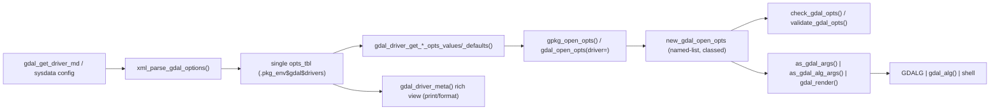

# Driver & Options Integration Plan

How the hand-built driver/options work in `dev/` and `data-raw/` promotes into the
package as a cohesive subsystem — not a bag of scripts. This is a *direction* doc:
the contracts and boundaries are intended to be stable; the field-level specifics
(exact tibble columns, which drivers warm at init, registry columns) are expected to
move in the weeds and are called out as such.

Companion docs:

- `options-architecture.md` — the four option channels and how they map to GDAL/CLI.
- `gdal-config-options.md` — curated per-driver config options (the one non-metadata channel).
- `ABSTRACTIONS.md` / `LANGUAGE.md` — module prefixes and the layer-delegation contract.

## 0. Grounding facts (verified against GDAL 3.13)

These constrain the design and are not assumptions:

- `gdal_get_driver_md(driver)` returns identity + capability metadata: `DMD_LONGNAME`,
  `DMD_EXTENSION(S)`, `DMD_MIMETYPE`, `DMD_HELPTOPIC`, `DMD_SUPPORTED_SQL_DIALECTS`,
  `DCAP_*` flags, and the three option XML lists (`DMD_OPENOPTIONLIST`,
  `DMD_CREATIONOPTIONLIST`, `DS_LAYER_CREATIONOPTIONLIST`).
- **Config options are not in driver metadata.** They exist only in the per-driver
  "Configuration options" doc sections and the CPL API. This is the single channel that
  must be curated (sysdata), everything else is metadata-derived.
- `gdalraster::getCreationOptions()` / `validateCreationOptions()` only read
  `DMD_CREATIONOPTIONLIST`, which is `NULL` for layer-only drivers (e.g. FlatGeobuf).
  The package must always read **both** creation lists itself. This is a core reason the
  package exists as a heavyweight layer over the 1:1 binding.
- Config precedence (GDAL >= 3.6): `GDAL_CONFIG_FILE` > env vars > `CPLSetConfigOption()` /
  `--config` / thread-local, with an optional `ignore-env-vars` file directive. `gdal_config`
  apply/restore must respect that this is process/session state, never embedded in an algorithm.
- The `$`-partial-match trap on the md list is real (`md$DMD_EXTENSION` silently returns
  `DMD_EXTENSIONS`). Always use exact `[[`.

## 1. Value proposition (why this is more than parsing)

`gdalraster` hands back raw `DCAP_*`/`DMD_*` lists and a creation-options accessor that is
wrong for layer-only drivers. Making that **legible, complete, and trustworthy** is a
headline feature of the package, on par with working pipelines. The driver subsystem is the
legibility layer; the options classes are the behavior layer.

## 2. Three knowledge tiers (the storage model)

| Tier | Holds | Where | Authoritative? |
|---|---|---|---|
| Curated static | config opts (~4-5 drivers) in `R/sysdata.rda`; name/alias/tier/slug/spec registry as a build-time constant (`GDAL_VECTOR_DRIVERS_REGISTRY` in `R/aaa.R`) | `R/sysdata.rda` + `R/aaa.R` | Yes |
| Warm cache | merged opts tbl for the **core** drivers (config+open+creation) | `.pkg_env$gdal$drivers` | No — rebuildable from live |
| Live on demand | open/creation rows for **any** registered driver | parsed per call, not stored | n/a (GDAL is truth) |
| Session state | user default-opt overrides; mutable registry edits | `.pkg_env$gdal` (distinct slots) | Yes (user intent) |

Consequences:

- No full-suite baking. sysdata holds only what GDAL cannot give us (config) plus curation.
- The warm cache is a **disposable speed cache** so `gpkg_*`/`fgb_*`/`gpq_*` builders skip XML
  re-parsing for validation/defaults. `refresh = TRUE` rebuilds it from the user's actual GDAL.
- Getters are universal regardless of cache membership; membership is a perf knob, not a gate.

## 3. The single options table (the canonical shape)

One schema, everywhere it flows (driver-raw CSV proof artifact: `dev/driver_opts_tbl.csv`):

```
driver | opt_type | name | description | scope | type | default | values(list)
```

- `opt_type` in `{config, open, dataset, layer}` (config = curated; the rest = `xml_parse_gdal_options()`).
- `scope` is the raster/vector axis (NA recoded to `"all"`); distinct from creation `level`.
- `values` booleans normalized to `c("YES","NO")`.

Everything (getters, validation universes, `.set_defaults` merges, the rich view) filters this
one shape. No per-channel sub-tables in the cache.

## 4. `.pkg_env` layout (lifecycle separation, shallow)

```
.pkg_env$gdal
├── sitrep    # version, alg API availability (probe; read-mostly)
├── config    # session config stack + restore records (MUTABLE)
├── vsi       # path-scoped opts, credentials (MUTABLE)
└── drivers   # knowledge cache
      ├── formats_tbl     # gdal_formats() snapshot (identity + flags)
      ├── registry_tbl    # curated GDAL_VECTOR_DRIVERS_REGISTRY copy (aliases/tier/slug/spec)
      ├── opts_tbl        # merged options table (DISPOSABLE warm cache, core drivers)
      └── overrides       # user default-opt overrides (SESSION STATE — never refreshed)

Phase 1 (done): `pkg_env_init()` nests the four `gdal` sub-envs; `gdal_drivers_init(refresh =)`
populates `drivers$formats_tbl` (216 rows), `drivers$registry_tbl` (12), and the warm
`drivers$opts_tbl` (~186 rows across `config`/`open`/`dataset`/`layer` for the core set).
`refresh = TRUE` rebuilds `opts_tbl` only; `overrides` is left untouched.
```

The nesting exists for **lifecycle**, not data modeling: `drivers$opts_tbl` is rebuildable;
`drivers$overrides`, `config`, `vsi` are real session state. `refresh` touches only the former.
`config`/`vsi` stay siblings of `drivers`, never folded in.

Init order (`zzz.R`): `pkg_env_init()` -> `gdal_config_init()` -> `gdal_drivers_init()`.

## 5. Responsibilities by file

### `R/gdal_drivers.R` — the knowledge facade

- **Name resolution** (`gdal_driver_resolve_name`): short/long/alias, case-insensitive, against
  `formats_tbl` + `registry_tbl`. `check_gdal_driver_name()` validates against **registered**
  drivers (not just core) so live-parse paths work for any driver.
- **Universal getters, cache-or-live**: keep the existing exported names
  (`gdal_driver_get_open_opts()`, `_creation_opts()`, `_defaults()`, `_values()`) so downstream
  builders don't churn; reimplement as filter-cache -> miss -> live-parse -> (optional) memoize.
  Config getter is sysdata-only (empty tibble for uncurated drivers, never an error).
- **Capability query** (`gdal_driver_supports`): structured flags from `formats_tbl`, dynamic
  fallback to live `DCAP_*`; missing -> FALSE, never error.
- **Listing with explicit scope**: `gdal_drivers(set = ..., what = ...)`. Keep `set`/`what`
  minimal (`core`/`registered` + filter) until a concrete consumer demands more — do not
  formalize a full tier taxonomy yet.
- **The rich view** (`gdal_driver_meta` -> classed `gdal_driver`): assembled on demand from the
  tables, with vignette-quality `print`/`format` (identity, name mapping, tier/role, caps, all
  three opt channels with counts, docs/spec/mime URLs). A *derived view*, never cached state,
  never a boundary type. This is where the demo-level UX lives.

### `R/gdal_opts.R` — the behavior layer (real migration)

Port the `dev/R/gdal_opts/gdal_opts_classes.R` **named-list-backed** model (the current package
file is character-vector backed and weaker). It earns its classes via two behavioral axes:

- **render**: CLI flag / algorithm arg name from kind (+ creation `level`).
- **apply**: config kind -> `set_config_option()`; vsi kind -> `vsi_set_path_option()`.

Integration seams (the cohesion that agents miss):

- validation universe = `gdal_driver_get_*_opts_values()` (driver layer), reached through a seam
  that degrades to "unknown universe -> allow".
- config opts carry a `driver` attr and feed `gdal_config` (config layer), not a driver object.
- normalization once at construction; `KEY=VALUE` pasting once in `as.character.gdal_opts`.
- `as_gdal_args()` (repeated-flag vector, always safe) and `as_gdal_alg_args()` (named-list,
  aborts on `=`/`,` in values) are the two render targets for GDALG / `gdal_alg()` / shell.
- driver dispatch-sugar subclass (`gpkg_open_opts`) from `registry_tbl` tier; degrades to nothing.

### Downstream builders (`fgb`/`gpkg`/`shp`/`gpq` + new `gdb`)

Near-zero churn: they already follow compact -> `check_gdal_opts(values)` -> `.set_defaults`
merge -> `new_gdal_*_opts`. After the opts rewrite they produce named-list-backed objects with
the sugar subclass. **Add `R/gdb_opts.R`** for OpenFileGDB (the known gap). GPKG
`PRELUDE_STATEMENTS` semantic checks remain a follow-on (`gpkg_prelude_pragmas()`).

### `R/gdal_config.R` / `R/gdal_vsi.R`

- `gdal_config`: stateful session object (apply/restore stack in `.pkg_env$gdal$config`),
  composing `gdal_config_opts`; respects the GDAL precedence chain; never embedded in algorithms.
- Driver-scoped config = `gdal_config_opts(..., driver=)` validated against
  `gdal_driver_get_config_opts_values()`; add curated `gpkg_config_opts()` etc. alongside
  existing `shp_config_opts()`.
- VSI path-scoped = `gdal_vsi_opts(path=)`; universe from `vsi_list_options()`. Seam only for now.

### `R/utils_pkg.R` / `R/zzz.R`

Nested `.pkg_env$gdal` shells; `gdal_drivers_init()` populates `drivers`; `refresh` rebuilds the
warm cache only. `.onUnload` restores any applied config.

## 6. End-to-end cohesion (one option's journey)



A single option name is parsed once, normalized once, validated against one universe, and
rendered through one of three targets. The driver layer produces the universe; the opts layer
consumes it; config/VSI apply the stateful subset; the view explains all of it.

## 7. Consistency conventions to hold

- Constructor triad per class: `gdal_*()` (boundary) / `as_gdal_*()` (coerce) / `new_gdal_*()`
  (bare). Predicates `is_gdal_*()`; assertions `check_gdal_*()` in `utils_checks.R`.
- Raw -> canonical exactly once, at the lowest layer that knows the rawness
  (`xml_parse_gdal_options` owns scope/boolean/NA quirks).
- String `driver` is the contract at every boundary; objects are resolved internally.
- Errors via the `gdalvector-conditions.R` spine (`gdal_abort_*`, `check_abort`), cli-formatted.
- Exact `[[` on md lists; never `$`.

## 8. Phasing (vertical slices, each load-able)

1. sysdata `registry_tbl` + nested `.pkg_env` + `gdal_drivers_init()` merge to one `opts_tbl`.
2. getters reimplemented cache-or-live; `resolve_name`, `supports`, `gdal_drivers(set, what)`;
   `check_gdal_driver_name` -> registered scope.
3. `R/gdal_opts.R` swap to named-list class model; verify builders; add `gdb_opts.R`.
4. `gdal_driver_meta()` rich classed view + print/format.
5. `gdal_config` stateful apply/restore; driver-/path-scoped config sugar (can trail the rest).

## 9. Deliberately open (not yet requirements)

- Exact `registry_tbl` columns (mime? magic bytes here vs `aaa.R` constants?).
- Which drivers warm at init vs purely live.
- Whether the warm cache memoizes live-parsed non-core drivers back into `opts_tbl`.
- `gdal_drivers(set, what)` defaults and whether a formal set taxonomy ever ships.
- Best-practice/optimal-default presets — leaning toward the DSN/source layer, not the driver.
